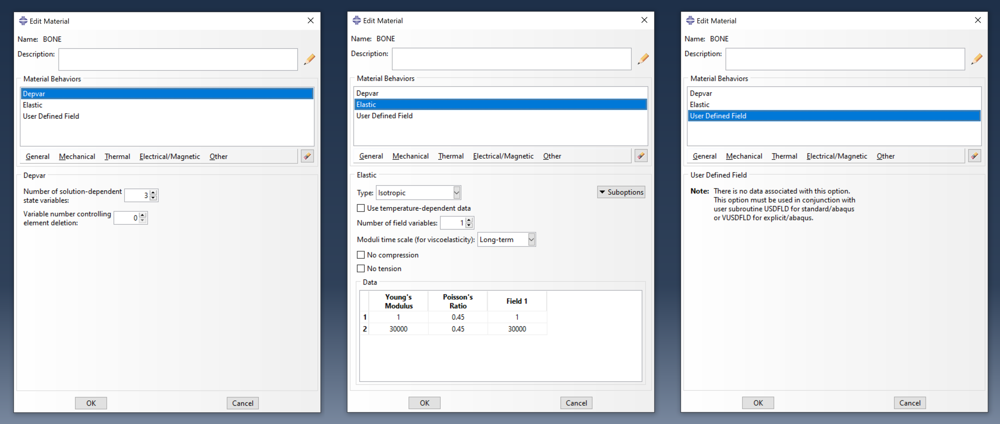
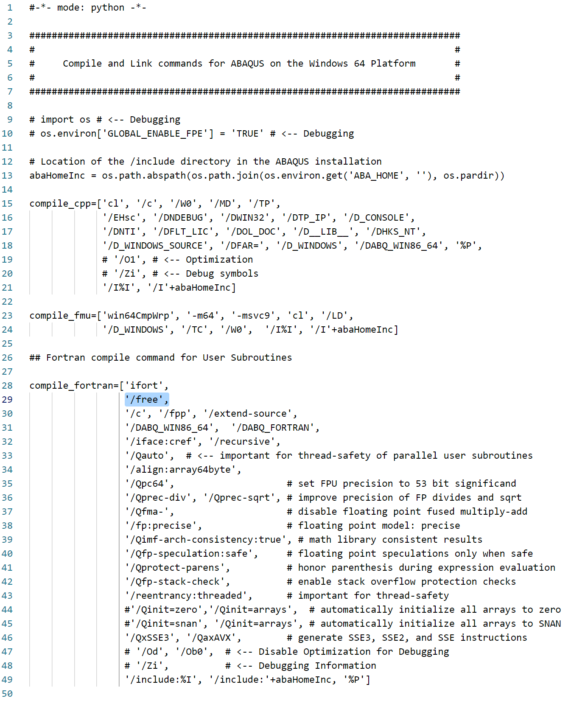

# User subroutines for applying bone material properties

Abaqus user subroutines USDFLD and VUSDFLD are provided to apply the bone properties from the bonemapy plugin to the model during an analysis. USDFLD is used by Abaqus/Standard and VUSDFLD is used by Abaqus/Explicit.

## Requirements

* A material with a User Defined Material must be used for the part for which the bone properties will be applied. For example, the material BONE has been defined as shown in the image below. This includes a number of solution dependent variables (DEPVARs) which will be used to create field outputs for visualisation of these fields.

  Note that FV and SDV should be added to the Field Output Requests, otherwise these dependent variables will not be written to the .odb file.

  

* The user subroutines are written in Fortran. Hence a Fortran compiler must be installed to be able to use them.

  Instructions on how to setup the Intel oneAPI toolkit on Windows, which contains the Intel Fortran compiler, can be found on the [Simuleon FEA Blog](https://info.simuleon.com/blog/free-fortran-compiler-on-windows-for-abaqus-material-modeling-0).

* The example Abaqus user subroutines provided here use the newer *free* Fortran format, not the traditional *fixed* format. Switching to free requires a small modification to the `compile_fortran` variable in the Abaqus environment file (.env). The fix is to add `'/free',` on the next line after the `'ifort',` entry.

  For a windows system (linux is similar), follows these steps:

  * Open environment file `win86_64.env` in a text editor, which is located in the site directory i.e. `C:\SIMULIA\EstProducts\2021\win_b64\SMA\site`

  * Scroll down to find where `compile_fortran` is defined

  * Add `'/free',` on the line following `'ifort',` as shown in the image of the env file shown below. Don't forget to add the comma at the end of the line.



## USDFLD for Abaqus/Standard

To run from the command line:
```
>>> abaqus job=jobname user=usdfld.f cpus=ncpus standard_parallel=SOLVER
```
where:
  * `jobname` is the name of the .inp file (but without the .inp extension)
  * `ncpus` is the number of cpus
  * `usdfld.f` is the name of the file containing the USDFLD subroutine
  * `standard_parallel=SOLVER` is required to prevent crashes in the subroutine when ncpus > 1. The default value is ALL. See Abaqus docs for details.

The provided USDFLD subroutine expects that the number of dependent variables to be DEPVAR = 3.

## VUSDFLD for Abaqus/Explicit

To run from the command line:
```
>>> abaqus job=jobname user=vusdfld.f cpus=ncpus double
```
where:
  * `jobname` is the name of the .inp file (but without the .inp extension)
  * `vusdfld.f` is the name of the file containing the VUSDFLD subroutine
  * `ncpus` is the number of cpus
  * `double` refers to double precision

The provided VUSDFLD subroutine expects that the number of dependent variables to be DEPVAR = 4. 

Note that an additional SDV, SDV1, is used compared to USDFLD to signify if the material properties has been applied to each material point or not. This variable can be ignored and is only required because of the differences in the way the subroutines are called in Standard vs Explicit.

## Examples

Example job files for both Abaqus/Standard and Abaqus/Explicit can be found in the [examples folder](examples). The [examples/shoulder/standard](examples/shoulder/standard) is the Abaqus/Standard version, and [examples/shoulder/explicit](examples/shoulder/explicit) is the Abaqus/Explicit version.

Each example folder should contain an Abaqus job file (.inp), a fortran user subroutine (.f) and a text file containing the HU values (i.e. HUvalues.txt).

### Abaqus/Standard

To run the shoulder example in Abaqus/Standard from the command line with 4 cpus, the following command can be used:
```
>>> abaqus job=shoulder user=usdfld.f cpus=4 standard_parallel=SOLVER
```
Solution dependent variables SDV1, SDV2, and SDV3 are created to view the HU values, apparent bone density (g/cm^3), and elastic modulus (MPa), respectively. Field output FV1 can also be used to view the elastic modulus.

### Abaqus/Explicit

To run the shoulder example in Abaqus/Explicit from the command line with 4 cpus, the following command can be used:
```
>>> abaqus job=shoulder user=vusdfld.f cpus=4 double
```
Solution dependent variables SDV1, SDV2, SDV3 and SDV4 are created to view the materials applied flag, HU values, apparent bone density (g/cm^3), and elastic modulus (MPa), respectively. Field output FV1 can also be used to view the elastic modulus.
